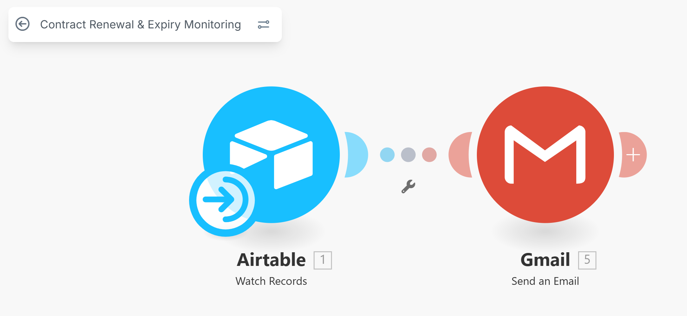

# 📄 Contract Renewal Automation

## Overview
Many companies lose revenue due to missed contract renewals or delayed follow-ups.  
This automation tracks contract expiry dates, sends proactive renewal reminders, and ensures account managers never miss critical deadlines.

✅ Reduces churn and missed renewals  
✅ Improves customer retention  
✅ Automates internal and external reminders  

---

## 🏷️ Metadata
- **Category:** Operations / Customer Success  
- **Size Classification:** Medium (2–5 tasks)  
- **Deployment Time:** 3–6 hours  
- **Version:** v1.0  

---

## 📊 Detailed Description
Manually tracking contract expirations is time-consuming and error-prone.  
This automation solves the problem by maintaining a centralized contract database and running scheduled checks to alert relevant stakeholders in advance.

Key actions include:
1. Maintaining a structured repository of contracts with expiry metadata.  
2. Running a cron job daily or weekly to check for contracts expiring in **30/60/90 days**.  
3. Sending **internal email reminders** to assigned account managers.  
4. (Optional) Sending **customer reminder emails** to start renewal negotiations.  
5. Logging all actions for visibility and SLA compliance.  

---

## ⚙️ How It Works

1. **Trigger:** A cron scheduler (or workflow automation) runs daily/weekly.  
2. **Database Query:** Checks contracts expiring within the next 30/60/90 days.  
3. **Internal Notifications:** Sends renewal reminders to the respective account manager or internal team.  
4. **Customer Notifications (Optional):** Sends a pre-renewal email to the client.  
5. **Reporting:** Updates internal logs or dashboards for contract renewal tracking.  

---

## 🛠️ Tools Required
- **Database:** Google Sheets / Airtable / SQL (contract repository)  
- **Scheduler:** Cron job / Zapier / n8n / Make  
- **Communication:** Gmail API / Slack / Microsoft Teams  
- **Optional:** Email template system (e.g., SendGrid / Gmail Draft)  

---

## 🔑 Setup Requirements
- Database table or sheet with columns:  
  `Contract ID | Client Name | Account Manager | Start Date | End Date | Renewal Status | Email`  
- API access to chosen communication channels (e.g., Gmail, Slack).  
- Cron or automation tool credentials.  
- Email templates for internal and external notifications.  

---

## 📈 Value Proposition
- **Time Saved:** ~10+ hours/month from manual tracking  
- **Revenue Impact:** Increased renewal rate and reduced churn  
- **Reliability:** 100% renewal visibility across contracts  

---

## 🎥 Demo Video
📌 *Coming soon...*  

---

## ⚠️ Known Limitations
- Requires consistent contract data formatting  
- Manual review needed for non-renewal or custom terms  
- Cron jobs may miss runs if the hosting environment goes down  

---

## 📢 Testimonials / Use Cases
- SaaS companies managing recurring contracts  
- Real estate or vendor management teams tracking service agreements  
- B2B account managers responsible for renewal retention  

---

## 🔄 Version & Updates
- **v1.0** – Database + Cron + Internal Email Reminder  
- **v1.1 (planned)** – Add customer-facing email notifications  
- **v1.2 (planned)** – Slack integration + renewal dashboard metrics  

---
