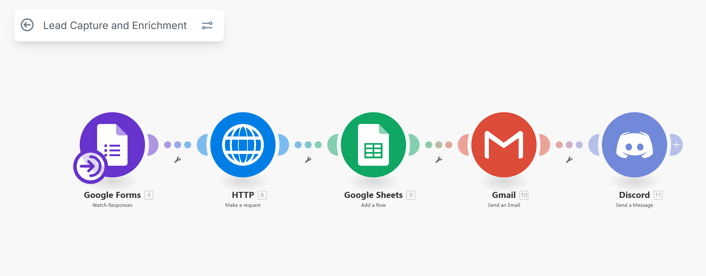

## 🚀 Lead Enrichment Automation

### 📌 Overview
Sales and marketing teams often deal with incomplete or outdated lead information, which slows down outreach and lowers conversion rates.  
This automation enriches leads by fetching missing company, role, and social profile details automatically.

✅ Improves data quality  
✅ Boosts personalization in outreach  
✅ Saves hours of manual research  

---

### 🏷️ Metadata
- **Category:** Sales / Marketing  
- **Size Classification:** Medium (6 tasks)  
- **Deployment Time:** 3–6 hours  
- **Version:** v1.0  

---

### 📊 Detailed Description
Currently, SDRs manually research leads on LinkedIn and other sources. This automation streamlines the process by:

1. Taking a list of leads from a CRM or Google Sheet.  
2. Enriching missing details (job title, company size, LinkedIn profile, industry, etc.).  
3. Validating email addresses for accuracy.  
4. Appending results back into the CRM/Google Sheet.  
5. Notifying the sales team when enrichment is complete.  

⏳ Saves ~20 hours/month and improves outreach effectiveness.

---

### ⚙️ How It Works

- **Trigger:** New lead added to CRM or Google Sheet.  
- **API Calls:** Uses enrichment APIs (Hunter.io).  
- **Data Update:** Appends enriched data into CRM/Sheets.  
- **Notification:** Slack/Discord message with enriched lead details.  

---

### 🛠️ Tools Required
- Google Sheets / CRM (HubSpot, Salesforce, Airtable)  
- Enrichment API (Clearbit, Apollo, PDL, etc.)  
- n8n / Zapier / Make  
- Slack / Discord webhook  

---

### 🔑 Setup Requirements
- CRM/Google Sheet with columns: `Name | Email | Company | Role | LinkedIn | Status`  
- API keys for enrichment provider  
- Slack/Discord webhook configured  
- Automation workspace (Zapier/Make/n8n)  

---

### 📈 Value Proposition
- **Time Saved:** ~20 hours/month  
- **Cost Saved:** ~$300 in manual research  
- **Accuracy:** Enriched, up-to-date lead profiles  

---

### 🎥 Demo Video
📌 *Demo Link Placeholder*

---

### ⚠️ Known Limitations
- API coverage depends on provider  
- Some leads may still require manual lookup  
- Paid enrichment credits required for scale  

---

### 📢 Testimonials / Use Cases
- SDR teams improving personalization in cold outreach  
- Marketing teams segmenting audiences by role/industry  
- RevOps teams cleaning CRM data  

---

### 🔄 Version & Updates
- **v1.0** – CRM → Enrichment API → Updated CRM/Sheets  
- **v1.1 (planned)** – Multi-provider fallback for better data coverage  
- **v1.2 (planned)** – Automated enrichment scheduling (weekly refresh)  
