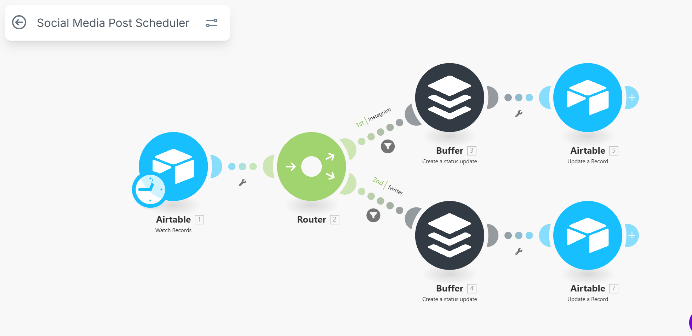

## 📄 Social Media Scheduler Automation

### 📌 Overview
Marketing teams often waste time manually scheduling posts across different platforms.  
This automation centralizes social media scheduling, allowing posts to be drafted once and auto-published across multiple channels.

✅ Eliminates repetitive posting  
✅ Ensures consistent brand presence  
✅ Increases team productivity  

---

### 🏷️ Metadata
- **Category:** Marketing / Content  
- **Size Classification:** Medium (5 tasks)  
- **Deployment Time:** 4–8 hours  
- **Version:** v1.0  

---

### 📊 Detailed Description
Currently, marketers manually log into multiple platforms to post content.  
This automation solves that by:

1. Taking scheduled posts from Google Sheets, Airtable, or Notion.  
2. Publishing automatically to LinkedIn, Twitter/X, Instagram, etc.  
3. Handling text, images, and hashtags.  
4. Logging published results into the database.  
5. Sending confirmation notifications to the team.  

⏳ Saves ~15 hours/month and improves scheduling consistency.

---

### ⚙️ How It Works

- **Trigger:** New scheduled post in Google Sheets/Notion/Airtable.  
- **Content Handling:** Prepares text, media, hashtags.  
- **API Calls:** Posts to LinkedIn, X (Twitter), Instagram, or Facebook.  
- **Data Logging:** Marks status in Sheets/DB.  
- **Notification:** Sends Slack/Discord confirmation with post links.  

---

### 🛠️ Tools Required
- Google Sheets / Airtable / Notion  
- Buffer 
- n8n / Zapier / Make  

---

### 🔑 Setup Requirements
- Content calendar in Sheets/Notion with columns:  
  `Platform | Date | Time | Content | Media URL | Status | Scheduled Post time`  
- API keys & OAuth setup for each social platform  
- Automation workspace (Zapier/Make/n8n)  

---

### 📈 Value Proposition
- **Time Saved:** ~15 hours/month  
- **Cost Saved:** ~$250 vs manual scheduling tools  
- **Consistency:** On-time posts across all platforms  

---

### 🎥 Demo Video
📌 *Demo Link Placeholder*

---

### ⚠️ Known Limitations
- APIs have posting restrictions (rate limits, media rules)  
- Instagram requires Business Account & Facebook Page link  
- OAuth tokens may need periodic refresh  

---

### 📢 Testimonials / Use Cases
- Marketing agencies managing multiple clients  
- Startups maintaining consistent online presence  
- Content creators scheduling posts across channels  

---

### 🔄 Version & Updates
- **v1.0** – Sheets/Notion → APIs → Multi-platform posting  
- **v1.1 (planned)** – Post analytics tracking (likes, shares, engagement)  
- **v1.2 (planned)** – AI-assisted caption & hashtag generation  

---
